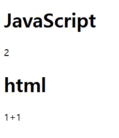
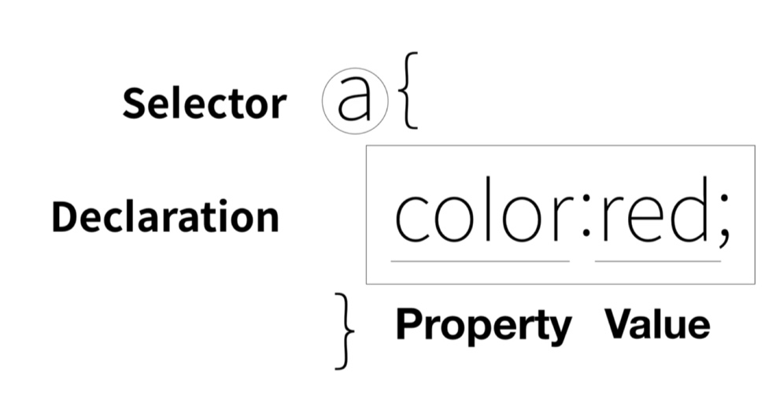
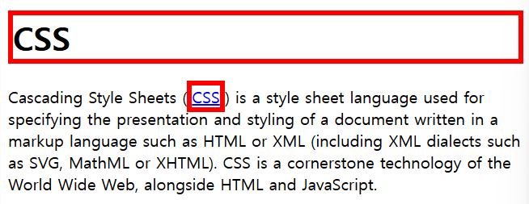
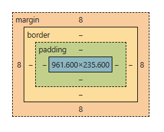

# <WEB 2>

생활코딩의 [WEB2 - JavaScript]와 구글링을 통해 공부

ref> [https://dev-ini.tistory.com/36](https://dev-ini.tistory.com/36)

## JavaScript

- html은 컨텐츠를 쓰는 정적인 언어

- CSS는 컨텐츠를 디자인하는 언어

- JavaScript는 컨텐츠와 사용자가 상호작용할 수 있게 만드는 동적인 언어

## HTML 태그와 JavaScript

### 기본 틀

- JS는 기본적으로 HTML 위에서 동작하는 언어

- html 코드에서 JavaScript가 들어가는 부분은 \<script> \</script> 안에 작성 

```html
<!DOCTYPE html>
<html>
    <head>
        <meta charset = "utf-8";>
        <title>
        </title>
    </head>
    <body>
			<script>
			
				// JavaScript 언어가 들어가는 부분]
				
			</script>
    </body>
</html>
```

- html은 정적, JavaScript는 동적

```html
<body>
        <h1>JavaScript</h1>
        <script>
            document.write(1+1);
        </script>
        <h1>html</h1>
        1+1
    </body>
```



## 이벤트(event)

> **onclick**: 버튼 등의 객체가 눌린 상태
> 
> - ex: <input [type =”button”] [value=”버튼 이름”] [**onclick**= “javascript 코드”]>
> - alert: 특정 상태에서 경고문을 띄움
>     
>     ```html
>     <body>
>     	<input type='button' value='hi' onclick="alert('hi')">
>     </body>
>     ```
>     

> **onchange**: 텍스트상자 등의 객체에 텍스트 입력과 같은 이벤트로 인해 상태가 바뀐 상태
> 
> - ex: <input [type =”text”] [**onchange**= “javascript 코드”]>
>     
>     ```html
>     <body>
>     	<input type="text" onchange="alert('changed')">
>     </body>
>     ```
>     

> **onkeydown**: 특정 키가 눌리면 이벤트가 발생
> 
> - ex: <input [type =”text”] [**onkeydown**= “javascript 코드”]>
>     
>     ```html
>     <body>
>     	<input type="text" onchange="alert('changed')">
>     </body>
>     ```
>     

## 데이터타입

- JS의 자료형에는 8가지의 데이터 타입이 존재
    
    기본 자료형 (원시형, Primitive Type)
    
    > Boolean
    > 
    > 
    > Null
    > 
    > Undefined
    > 
    > Bigint
    > 
    > Number (숫자)
    > 
    > String (문자열)
    > 
    > Symbol
    > 
    
    - 값이 생성된 이후에는 변경할 수 없음
    
    - 다른 변수에 값을 할당하거나 함수 인자로 전달할 경우, 값을 복사하여 전달 (pass by value)
    
    객체 자료형 (참조형, ReferenceType)
    
    > Object 배열, 함수, 사용자 정의 클래스를 모두 포함
    > 
    
    - 객체의 주소를 복사하여 전달 
    
- 기본 자료형
    
    > **Number**
    > 
    > 
    > - 정수 및 부동소수점 숫자
    > 
    > - NaN, 무한대, -무한대를 포함 
    > 
    
    > **Bigint**
    > 
    > 
    > - 숫자형으로 나타낼 수 없는 2^53-1 보다 크거나 -2^53-1보다 작은 값을 표현하기 위해 사용
    > 
    
    > **String**
    > 
    > 
    > - 큰따옴표(””), 작은따옴표(’’), 역따옴표(``)
    > 
    > - 역따옴표로 변수나 표현식을 감싼 후 ${…}안에 넣어주면, 원하는 변수나 표현식을 문자열 중간에 넣을 수 있음
    > 
    
    > **Boolean**
    > 
    
    > **Null**
    > 
    
    > **Undefined**
    > 
    > 
    > - Null과 Undefined는 비슷해보이지만 다르다!
    > 
    >   Null은 의도적으로 null이라는 값을 할당한 상태이지만 Undefined는 값 자체가 할당되지 않은 상태임
    > 
    
    > **Symbol**
    > 
    > 
    > - 변경 불가능한 유일한 값
    > 
- 객체 자료형
    
    > **Object**
    > 
    > 
    > - 객체: 식별자로 참조할 수 있는 메모리 값
    > 
    > - 데이터 컬렉션이나 복잡한 개체(entity)를 표현할 수 있음
    > 
    > - 객체는 중괄호{} 안에 키(key):값(value)쌍으로 이루어진 프로퍼티(property)를 넣어 만들 수 있음
    > 
    > - key에는 문자형, value에는 모든 자료형이 가능
    > 
    > - 빈 객체 만드는 방법
    >     
    >     `let user = new Object();`
    >     <br>`let user = {};` 
    >     
    > - 프로퍼티 값 얻기
    >     
    >     `alert([객체명].[key]);` 
    >     
    >     `console.log([객체명].[key]);`
    >     
    > - 프로퍼티 추가하기
    >     
    >     `[객체명].[key]=[value];` 
    >     
    > - 프로퍼티 삭제하기
    >     
    >     `delete[객체명].[key];`
    >     
    >     ```jsx
    >     let user = {name:"John", age: 30, "like birds":true};
    >     
    >     alert(user.name); //John
    >     user.isAdmin = true; //user객체에 isAdmin:true 프로퍼티 추가
    >     delete user.age; //user객체에 age:30 프로퍼티 삭제
    >     console(user.["like birds"]); //true
    >     ```
    >     
    > - 계산된 프로퍼티 (computed property)
    >     
    >     ```jsx
    >     let fruit = prompt("어떤 과일을 구매하시겠습니까?", "");
    >     let bag = {[fruit]:5,};
    >     
    >     alert(bag.apple); //fruit에 apple이라는 키가 존재하면 true 반환
    >     ```
    >     
    > - **in 연산자로 프로퍼티 존재 여부 확인**
    >     
    >     `“key” in [object]`
    >     
    >     ```jsx
    >     let user = {name:"John", age: 30, "like birds":true};
    >     
    >     alert(user.name); //John 
    >     alert("age" in user); //true
    >     ```
    >     
    > - **for** key **in** object
    >     
    >     ```jsx
    >     let user = {
    >       name: "John",
    >       age: 30,
    >       isAdmin: true
    >     };
    >     
    >     for (let key in user) {
    >       alert( key );  // 키 값(name, age, isAdmin)
    >       alert( user[key] ); // value값(John, 30, true)
    >     }
    >     ```
    >     
    > - **for** of 연산자
    >     
    >     - 일반 객체 메소드
    >     
    >     ```jsx
    >     Object.keys(user); //key값을 담은 배열 반환
    >     Object.values(user); //value값을 담은 배열 반환
    >     Object.entries(user); //[key:value] 을 담은 배열[[Array][Array]] 반환
    >     ```
    >     
    >     ```jsx
    >     letuser = {
    >       name: "John",
    >       age: 30,
    >       isAdmin: true
    >     };
    >     
    >     for(let key of Object.keys(user)){
    >        alert(key);
    >     }
    >     ```
    >

## JavaScript 문법(Syntax)

[String - JavaScript | MDN](https://developer.mozilla.org/ko/docs/Web/JavaScript/Reference/Global_Objects/String)

> **var** *varName*
> 
> 
> : 변수
> 

> *str*.indexOf(***searchValue***)
> 
> 
> : 문자열에서 특정 문자가 몇번째에 있는지 확인
> 
> ```jsx
> const sentence = "Hello World";
> console.log(sentence.indexOf("l")); //2
> ```
> 

> *str*.toUpperCase()
> 
> 
> : 문자열을 모두 대문자로 바꿔서 보여줌 
> 
> ```jsx
> const sentence = "Hello World";
> console.log(sentence.toUpperCase()); //HELLO WORLD
> ```
>
> 
## 조건문

- 동등 비교연산자: **===**
- 비교 연산자:  **\&lt;** (less than)
    
    ```css
    <!-- 버튼을 누르면 배경,글자색을 반전시켜주는 버튼-->
    
    <input id="night_day" type="button" value="night" onclick="
            if(document.querySelector('#night_day').value==='night'){
                document.querySelector('body').style.backgroundColor = 'black';
                document.querySelector('body').style.color = 'white';
                document.querySelector('#night_day').value='day';
            }else{
                document.querySelector('body').style.backgroundColor = 'white';
                document.querySelector('body').style.color = 'black';
                document.querySelector('#night_day').value='night';
    
            }
     ">
    ```
    

## 배열과 반복문

- 배열
    
    - 배열에 저장되어 있는 값을 가져오는 방법: *Array* [*index*] 
    
    - 배열의 요소의 개수: *Array* **.length**
    
    - 값을 넣는 방법: *Array* **.push()**
    
- 반복문
    - for문
        
        ```css
        for(let i = 0; i<10; i++){
        	console.log(i);
        }
        ```
        
        - `let i = 0` : let을 이용하여 변수 i를 선언하고 0을 할당하여 초기값 설정
    - for … of
            
        ```css
        const array = ['1번', '2번', '3번'];
        
        for(const element of array) {
          console.log(element); // 배열[0] ~ 끝까지 순차적 출력
          console.log(array); // 배열 전체 출력
        }
        //출력결과
        //1번
        //['1번', '2번', '3번']
        //2번
        //['1번', '2번', '3번']
        //3번
        //['1번', '2번', '3번']
        ```
        
    - for … in
        
        - 배열보다는 object에 주로 사용 
        
        ```css
        const obj = {
          name : '이름',
          age : '나이'
        }
        
        for(const key **in** obj){
          console.log(key); 
          console.log(`key 값 : ${key}`); 
          console.log(`value 값 : ${obj[key]}`); 
        }
        
        //출력결과 
        //name
        //key 값 : name
        //value 값 : 이름
        //age
        //key 값 : age
        //value 값 : 나이
        ```
        
        - obj.name과 같이 사용하려면 object내에 name이라는 key값을 가진 value가 존재해야한다.
        
    - while
        
        ```css
        while(condition) {
          // condition이 true이면 실행
        }
        ```
        

## 리팩토링, 중복의 제거

중복으로 인해 비효율적인 코드를 개선하기 위해 리팩토링을 통해 코드의 중복을 제거

> **this & 변수**
> 
> 
> 아래 html 코드내에서 자기 자신을 지칭하는 키워드 this와 변수를 이용해 중복을 최소화하여 리팩토링한다.
> 
> ```css
> <input type="button" value="night" onclick="
>         var target = document.querySelector('body');
>         if(this.value==='night'){
>            target.style.backgroundColor = 'black';
>            target.style.color = 'white';
>             this.value='day';
>         }else{
>            target.style.backgroundColor = 'white';
>            target.style.color = 'black';
>             this.value='night';
>         }
>     ">
> ```
> 
> **함수/메소드**
> 
> 함수는 반복되는 코드의 재사용을 줄일 수 있는 방법 중 하나로, 매개 변수(parameter)를 인자로 받아 값을 return
> 
> ```html
> <!DOCTYPE html>
> <html>
>     <head>
>         <meta charset = "utf-8";>
>         <title>Function-example</title>
>     </head>
>     <body>
>         <h1>Function</h1>
>         <h2>Basic</h2>
>         <ul>
>             <script>
>                 //함수 선언 및 정의
>                 function two(){
>                     document.write('<li>2-1</li>');
>                     document.write('<li>2-2</li>');
>                 }
> 
>                 document.write('<li>1</li>');
>                 two();
>                 document.write('<li>3</li>');
>                 two();
>             </script>
>         </ul>
>         
>         <h2>Parameter & Argument</h2>
>         <script>
>             //함수 선언 및 정의
>             function sum(x, y){
>                 document.write(x+y+'<br>');
>             }
>             
>             sum(1,2);   //3
>         </script>
> 
>         <h2>Return</h2>
>         <script>
>             function sumColored(x, y){
>                 document.write('<div style="color:red">'+x+y+'</div><br>');
>             }
>             function sum2(x,y){
>                 return x+y;
>             }
>             sumColored(3,4);   //3
>             document.write(sum2(1,2)+'<br>');
>             document.write('<div style="color:green">'+sum2(5,10)+'</div>');
>             document.write('<div style="font-size: 3rem">'+sum2(10,20)+'</div>');
>         </script>
>     </body>
> </html>
> ```
> 

## 객체(Object)

- **객체 { }**
    
    - 객체는 중괄호{ } 안에 키(key):값(value)쌍으로 이루어진 프로퍼티(property)를 가짐
    
    - 배열에서는 대괄호, 객체는 중괄호를 사용하여 생성 
    
    - 객체의 생성: var *변수명* = { “key”:”value”, “key”:”value”, …};
    
    - 객체 저장되어 있는 값을 가져올때: *Object*.**key**
    
    - 객체에 프로퍼티를 추가 : *Object* **.key = “value”** */  (만약 key값에 띄어쓰기를 포함하고 싶다면 Object* **.[”key title”] = “value”**
    

```html
<!DOCTYPE html>
<html>
    <head>
        <meta charset = "utf-8";>
        <title>Object-example</title>
    </head>
    <body>
        <h1>Object</h1>
        <h2>객체 생성</h2>
        <script>
            var coworkers = {
                "programmer":"cozyu", "designer":"ayk"
            };
            document.write("programmer: "+coworkers.programmer+'<br>');
            document.write("designer: "+coworkers.designer+'<br>');
            coworkers.bookkeeper = "ridi";
            document.write("bookkeeper: "+coworkers.bookkeeper+'<br>');
            coworkers["data scientist"] = "yu";
            document.write("data scientist: "+coworkers["data scientist"]+'<br>');
        </script>
        <h2> 객체의 프로퍼티와 메소드드</h2>
	<script>
            coworkers.showAll= function(){
                for(var key in this){
                document.write(key+": "+this[key]+'<br>');
                }
            };
            coworkers.showAll()
	</script>    
	</body>
</html>
```

- **객체의 반복문** **for … in**
    
    - 객체 안에 있는 key값을 대상으로 반복문 실행
    

```html
<h2>iterate</h2>
<script>
for(var key in coworkers){
	document.write(coworkers[key]+"<br>");
}
</script>
```

## 라이브러리와 프레임워크

- jQuery: javascript를 보다 직관적으로 표현할 수 있는 라이브러리

```jsx
var Body={
setColor:function(color){
    //document.querySelector('body').style.color = color;},// javascript로 작성한 코드
    $('body').css('color', color);}, //jQuery로 작성한 코드
  
setbgColor:function(color){
    //document.querySelector('body').style.backgroundColor = color;}// javascript로 작성한 코드
     $('body').css('backgroundColor', color);}//jQuery로 작성한 코드
}
```

## UI & API

- UI는 사용자가 시스템을 조작하기 위해 사용할 수 있는 장치의 화면상 배치로, 프로그래머 ↔ 사용자간의 상호작용에 집중

- API는 UI가 동작하기 위해 필요한 응용프로그램 인터페이스, 운영체제와의 상호작용 형식 등을 포함한다.

# CSS

- CSS는 웹페이지 디자인과 관련된 언어로, <style> </style> 안에 작성
- 웹페이지 코드를 해석할 때, 디자인이 아닌 정보만을 가지고 있는 코드를 분석하고 싶다면 <style> </style>을 제외한 부분을 보면 됨

# CSS

- CSS는 웹페이지 디자인과 관련된 언어로, \<style> \</style> 안에 작성
- 웹페이지 코드를 해석할 때, 디자인이 아닌 정보만을 가지고 있는 코드를 분석하고 싶다면 \<style> \</style>을 제외한 부분을 보면 됨

## style

> **스타일 태그: \<style> \</style>**
> 
> 
> : 여러 개의 태그에 대해서 CSS를 적용하고 싶을 때 적용을 원하는 태그의 선택자 { } 를 이용하여 작성할 수 있음
> 
> ```jsx
> <head>
> 	<style>
> 		a {  //모든 a 태그에 대하여
> 			color:red; //색상을 red로 지정
> 			text-decoration: none; //밑줄을 없앰
> 		}
> 		#active{ //"active"라는 id에 속한 태그에 대하여 
> 			color:blue;
> 		}
> 		.saw{ //"saw"가 포함된 클래스에 속한 태그에 대하여
> 			color:gray;
> 		}
> 		h1{
> 			font-size: 60px;
> 			text-align: center; //가운데 정렬
> 		}
> 	</style>
> </head>
> ```
> 

> ***스타일 속성:** \<tag*  **style =” ”>** \</tag>
> 
> 
> : HTML 코드 내에서 특정 태그에 대해서 CSS 문법을 적용하고 싶을 때 “ “안에 CSS 코드를 작성
> 
> - CSS간의 구분은 ;로
> 
> ```jsx
> <h1><a href="index.html">WEB</a></h1>
>     <ol>
>         <li><a href="1.html" class="saw">HTML</a></li>
>         <li><a href="2.html" style="color:blue;text-decoration:underline"> CSS</a></li>
>         <li><a href="3.html" class="saw">JavaScript</a></li>
>     </ol>
> ```
> 

## 스타일 프로퍼티



- 선택자는 태그 < 클래스(class) < 아이디(id) 순서로 declaration을 적용
    - 사용 방법
        
        - 태그: *tag* {…}
        
        - 클래스: ***.**class* {…}
        
        * class=“a”, class=“ab”가 존재할 때, 선택자가 .a{ } → .b{ } 순서대로 온다면 “ab”클래스는 .b{ }를 따름
        
        * class=“a”, class=“ab”가 존재할 때, 선택자가 .b{ } → .a{ } 순서대로 온다면 “ab”클래스는 .a{ }를 따름
        
        - 아이디: ***#**id* {…}
        
        * id는 중복되면 안됨
        
    - 개발할 떄는 보통 태그 선택자를 통해서 전체적인 디자인을 먼저 해두고, 예외적인 부분에 아이디 선택자로 디자인
- 스타일 프로퍼티
    
    > **color: [color]**
    > 
    > 
    > : 색상 지정
    > 
    
    > **text-decoration: [option]**
    > 
    > 
    > : 서식 꾸미기 (underline, dotted, none 등)
    > 
    
    > **font-size: [option]**
    > 
    > 
    > : 글자 크기
    > 
    
    > **text-align: [option]**
    > 
    > 
    > : 글자 정렬
    > 

## 박스 모델

- block level element
    
    화면 전체 영역을 사용하는 태그 (ex: h1, div)
    
- inline element
    
    자기 자신의 부피만큼의 영역을 사용하는 태그 (ex: a, span) 
    



```html
<div>div is </div>
<div>block level element</div>
//div is
//block level element

<span>span is </span>
<span>inline element</span>
//span is inline element
```

\<h1> 태그는 화면 전체 영역를 사용하는 block level element

\<a> 태그는 자기 자신만을 사용하는 inline element

\<div> 태그는 body 안에서 각 영역의 세션을 구분하는 block level element

\<span> 태그는 일반적으로 텍스트의 색상, 크기, 좌우간격 등을 조절하는데 사용는 inline element

```html
<!DOCTYPE html>
<html>
    <head>
        <meta charset="utf-8">
        <title></title>
        <style>
            h1, a{
                /*
                border-width:5px;
                border-color:red;
                border-style:solid;
                */
                border: 5px red solid; //순서는 상관없음
                padding:20px;
                margin:50px;
                width:60px;
						}
        </style>
    </head>
    <body>
        <h1>CSS</h1> Cascading Style Sheets (<a href="https://en.wikipedia.org/wiki/CSS">CSS</a>) is a style sheet language used for specifying the presentation and styling of a document written in a markup language such as HTML or XML (including XML dialects such as SVG, MathML or XHTML). CSS is a cornerstone technology of the World Wide Web, alongside HTML and JavaScript.
    </body>
</html>
```

- 스타일 프로퍼티
    
    > **border-width: [option]**
    > 
    > 
    > **border-color: [option]**
    > 
    > **border-style: [option]**
    > 
    > **= border: [option] [option] [option]**
    > 
    > : 테두리
    > 
    
    > **padding: [option]**
    > 
    > 
    > : 글자와 테두리 간의 간격
    > 
    
    > **margin: [option]**
    > 
    > 
    > : 테두리와 테두리 간의 간격
    > 
    > 
    > 
    
    > **display: [option]**
    > 
    > 
    > : 선택자의 표시 옵션 (block, grid, none 등)
    > 

## 그리드(grid)

```html
<!DOCTYPE html>
<html>
    <head>
        <meta charset="utf-8">
        <title></title>
        <style>
            div{
                border:5px solid pink;
            }
            #grid{
                border:5px solid gray;
                display:grid;
                grid-template-columns: 150px 1fr; /*grid를 이루는 요소들의 column 배열을 첫번째 요소는 150px로 고정하고, 두번째 요소는 나머지 프레임 전체를 사용*/
            }
        </style>
    </head>
    <body>
        <div id="grid"> <!--두 개의 자식 div태그를 감싸는 부모 div태그의 id를 "grid"로 지정-->
            <div>NAVIGATION</div>
            <div>ARTICLE</div>
        </div>  
</html>
```

## 반응형 디자인 - 미디어쿼리

> **@media(조건){…}**
> 
> 
> : 특정 조건이 만족될 경우 선택자 안의 쿼리가 수행되도록 함
> 

```css
@media(max-width:800px){
            #grid{
                display:block
            }
            ol{
            border-right:none;
            width:800px;
            border-bottom:3px solid gray;
        }
```

## 코드의 재사용

- CSS 코드가 여러 페이지에 동일하게 적용되는 경우엔, CSS 코드를 따로 .css로 저장하고, 이 파일을 각 페이지에 연결하는 것이 중복을 줄여 경제성이 높은 코딩방식이다

> **\<link rel="stylesheet" href="style.css">**
> 
> 
> : 현재 html 페이지의 스타일을 꾸미는데 사용되는 스타일시트인  href="style.css"라는 파일을 불러오는 링크
>
