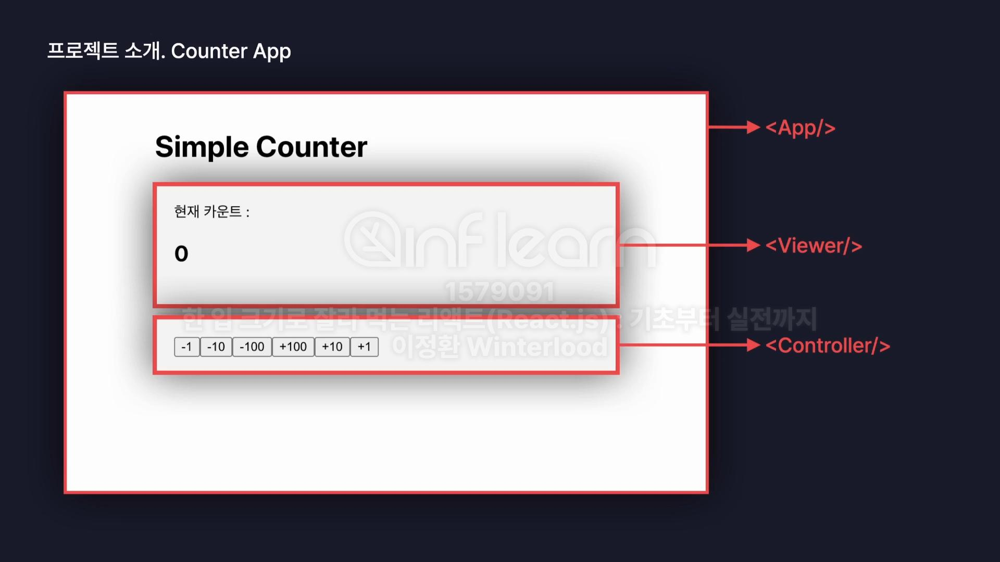

# 클론 코딩1 - 카운터 앱



- 새로운 리액트 앱을 생성시 세팅해야 하는 부분
    - eslint.confing.js 파일의 rules 부분에서 아래 코드를 넣어서 수정해줘야 함
        
        ```
        'no-unused-vars': "off",
        "react/prop-types":"off",
        ```
        
    - public 폴더의 vite.svg 파일 삭제, src - assets 폴더의 react.svg 파일 삭제
    - App.jsx 파일에서 `import ‘./App.css’`와 App 컴포넌트의 return문을 제외하고 나머지 삭제
    - App.css, index.css 내용 삭제
    - main.jsx 파일의 \<StrictMode> 삭제
- UI 구현
    - Viewer.jsx
        
        ```jsx
        const Viewer = ()=>{
            return(
                <div>
                    <div>현재 카운트 :</div>
                    <h1>0</h1>
                </div>
            );
        }
        
        export default Viewer;
        
        ```
        
    - Controller.jsx
        
        ```jsx
        const Controller = ()=>{
            return(
                <div>
                    <button>-1</button>
                    <button>-10</button>
                    <button>-100</button>
                    <button>+1</button>
                    <button>+10</button>
                    <button>+100</button>
                </div>
            );
        }
        
        export default Controller;
        
        ```
        
    - App.jsx
        
        ```jsx
        import './App.css'
        import Viewer from './components/Viewer'
        import Controller from './components/Controller'
        function App() {
          
          return (
            <div className="App">
              <h1>Simple Counter</h1>
              <section >
                <Viewer/> 
              </section>
              <section>
                <Controller/> 
              </section>
              
            </div>
          )
        }
        
        export default App
        
        ```
        
    - App.css
        
        ```css
        body{
            padding: 20px;
        }
        .App{
            margin: 0 auto;
            width: 400px;
        }
        .App > section{
            background-color: rgb(245,245,245);
            border: 1px solid, rgb(240,240,240);
            border-radius: 5px;
            padding: 20px;
            margin-bottom: 10px;
        }
        ```
        
- 기능 부여하기 → state는 어디에 위치시켜야 할까?
    - 특정 값을 변경시켰을 때, 변경된 값을 컴포넌트가 즉시 화면에 렌더링하도록 설정하려면, state를 이용해야함 → state 값이 변경될 때마다 리렌더링
    - 그렇다면 state는 App, Controller, Viewer 컴포넌트 중 어디에 만들어야할까? **App.jsx**
        
        : 값을 변경시키는 Controller 컴포넌트와 값을 보여주는 Viewer 컴포넌트는 서로 부모자식 관계가 아니므로 props를 이용해서 어떠한 값도 서로 공유할 수 있는 상태가 아님.
        
        
        
        
        
        
        
        > **State Lifting (스테이트 리프팅)**
        > 
        > - 리액트에서 화면을 구성할 때 여러 개의 컴포넌트들이 서로 부모와 자식 관계를 이루며 계층 구조를 형성
        > - 특정 컴포넌트가 다른 컴포넌트에게 데이터를 전달하려면(props) 반드시 두 컴포넌트는 서로 부모 자식 관계를 가지고 있어야 함
        > - 따라서 하나의 state를 여러 컴포넌트에서 관리하게 될 경우 이 state는 반드시 부모 컴포넌트에 만들어 주어야 함
        > 
        > 
        > 
    - App.jsx: useState를 사용하여 state를 각 자식 컴포넌트에게 넘겨줌. Viewer.jsx에는 state인 count를, Controller.jsx에는 state를 업데이트하는 이벤트 핸들러 onClickButton을 넘겨줌
        
        ```jsx
        import './App.css'
        import Viewer from './components/Viewer'
        import Controller from './components/Controller'
        import {useState} from "react";
        
        function App() {
          const [count, setCount]=useState(0);
        
          //Controller 컴포넌트의 button을 누르면 값을 더하고 빼는 이벤트 핸들러
          const onClickButton=(value)=>{
            setCount(count+value);
          };
        
          return (
            <div className="App">
              <h1>Simple Counter</h1>
              <section >
                <Viewer count={count}/> 
              </section>
              <section>
                <Controller onClickButton={onClickButton}/> 
              </section>
              
            </div>
          )
        }
        
        export default App
        
        ```
        
    - Controller.jsx
        - state의 값을 변경하는 이벤트 핸들러인 onClickButton을 구조분해할당으로 받아와서 버튼이 클릭되면 value 값을 넘겨줄 수 있도록 함
        
        ```jsx
        	const Controller = ({onClickButton})=>{
            return(
                <div>
                    <button onClick={()=>{
                        onClickButton(-1)
                    }}>-1</button>
                    <button onClick={()=>{
                        onClickButton(-10)
                    }}>-10</button>
                    <button onClick={()=>{
                        onClickButton(-100)
                    }}>-100</button>
                    <button onClick={()=>{
                        onClickButton(+1)
                    }}>+1</button>
                    <button onClick={()=>{
                        onClickButton(+10)
                    }}>+10</button>
                    <button onClick={()=>{
                        onClickButton(+100)
                    }}>+100</button>
                </div>
            );
        }
        
        export default Controller;
        
        ```
        
    - Viewer.jsx: state 객체를 매개변수로 사용
        
        ```jsx
        	
        const Viewer = ({count})=>{
            return(
                <div>
                    <div>현재 카운트 :</div>
                    <h1>{count}</h1>
                </div>
            );
        }
        
        export default Viewer;
        
        ```
        
- 결과물

