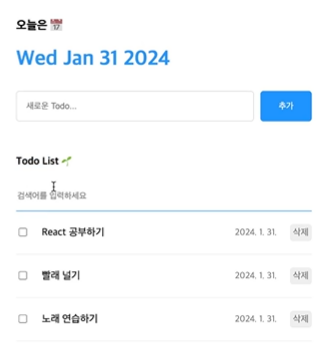

# 클론 코딩 02 - 투두리스트

초기 설정은 클론 코딩 01 참고

## UI구현



### Header 컴포넌트

> **Header.jsx**
> 
> 
> ```jsx
> import './Header.css'
> 
> const Header = ()=>{
>     return <div className="Header">
>         <h3>오늘은 📆</h3>
>         <h1>{new Date().toDateString()}</h1>
>     </div>
> }
> 
> export default Header;
> ```
> 
> - 현재 날짜를 출력: `toDateString()`은 고정된 형식(`Wed Mar 26 2025`)으로 날짜를 출력
>     - `new Date()`
>         - 현재 날짜와 시간을 나타내는 `Date` 객체를 생성
>     - `.toDateString()`
>         - `Date` 객체를 사람이 읽을 수 있는 문자열 형식으로 변환

> **Header.css**
> 
> 
> ```css
> .Header > h1{
>     color:rgb(37,147,255);
> }
> ```
> 
> - Header.jsx의 태그의 클래스가 Header인 \<div>태그의 자식 태그인 \<h1>태그의 색상을 지정

### Editor 컴포넌트

> **Editor.jsx**
> 
> 
> ```jsx
> import './Editor.css'
> const Editor = ()=>{
>     return <div className = "Editor">
>         <input placeholder="새로운 Todo..."></input>
>         <button>추가</button>
>     </div>
> }
> 
> export default Editor;
> ```
> 

> **Editor.css**
> 
> 
> ```css
> .Editor{
>     display: flex;
>     gap: 10px;
> 
> }
> .Editor > input {
>     flex: 1;
>     padding: 15px;
>     border: 1px solid rgb(220,220,220);
>     border-radius: 5px;
> }
> 
> .Editor > button{
>     cursor: pointer;
>     width: 60px;
>     border: none;
>     background-color: rgb(37,147,255);
>     color: white;
>     border-radius: 5px;
> }
> ```
> 
> - `display: flex;`는 CSS Flexbox 레이아웃을 활성화하는 속성으로, 요소들을 한 줄(row) 또는 여러 줄(column)로 정렬하고, 유연하게 크기를 조절할 수 있도록 함.
>     - 해당 요소는 부모(Container) 역할을 하며, 그 안에 있는 자식 요소(Item)들이 자동으로 정렬됨
>     - 기본적으로 가로 방향(행, row)으로 배치
> - `flex: 1;`을 적용하면, 해당 요소가 남은 공간, 즉 부모 컨테이너에서 가용한 공간을 모두 사용하게 됨.
> - `cursor: pointer;`는 마우스를 해당 요소 위에 올리게 되면, 커서 모양이 pointer로 바뀜

### List 컴포넌트

> **List.jsx**
> 
> 
> ```jsx
> import './List.css'
> import TodoItem from './TodoItem';
> const List = ()=>{
>     return <div className = "List">
>         <h4>ToDO List 🌱</h4>
>         <input placeholder="검색어를 입력하세요."></input>
>         <div className="Todos_Wrapper">
>             <TodoItem/>
>             <TodoItem/>
>             <TodoItem/>
>         </div>
>     </div>
> }
> 
> export default List;
> ```
> 
> - TodoItem이라는 컴포넌트를 추가로 만들어서 Todos_Wrappers 아래에 배치

> **List.css**
> 
> 
> ```css
> .List{
>     display:flex;
>     flex-direction: column;
>     gap:20px;
> }
> .List > input {
>    width: 100%; 
>    border: none;
>    border-bottom: 1px solid rgb(220,220,220);
>    padding: 15px 0px;
> }
> 
> .List > input:focus{
>     outline:none;
>     border-bottom: 1px solid rgb(37,147,255);
> }
> 
> .List .Todos_Wrapper{
>     display:flex;
>     flex-direction: column;
>     gap:20px;
> }
> ```
> 
> - `padding: 상하여백크기 좌우여백크기`
> - `.List > input:focus{}`: \<input> 태그가 focus되었을 때
>     - `outline:none; focus`되었을 때 생기는 외곽선을 없앰

> **TodoItem.jsx**
> 
> 
> ```jsx
> import './TodoItem.css'
> const TodoItem = ()=>{
>     return(
>         <div className = "TodoItem">
>             <input type="checkbox"/>
>             <div className="content">Todo...</div>
>             <div className="date">Date</div>
>             <button>삭제</button>
>         </div>
>     )
> }
> 
> export default TodoItem;
> ```
> 
> - 부모태그 아래에 \<div> 태그가 2개 있으므로 각 \<div> 태그마다 className 부여

> **TodoItem.css**
> 
> 
> ```css
> .TodoItem  {
>     display:flex;
>     align-items: center;
>     gap: 20px;
>     padding-bottom: 20px;
>     border-bottom: 1px solid rgb(240,240,240);
> }
> .TodoItem input{
>     width: 20px;
> }
> 
> .TodoItem .content {
>     flex: 1;
> }
> 
> .TodoItem .date {
>     font-size:14px;
>     color: gray;
> }
> 
> .TodoItem > button{
>     cursor: pointer;
>     font-size:14px;
>     color: gray;
>     border: none;
>     border-radius: 5px;
>     padding: 5px;
> }
> ```
> 

## 기능 구현

- 새로운 데이터가 추가/수정/삭제 되었을 때 바로바로 화면에 변화를 반영하기 위해서 TodoItem 컴포넌트의 데이터를 state로 만들어서 보관해야 함
    - 모든 컴포넌트의 조상이 되는 App 컴퍼넌트에 state를 배치해줘야 함
- 추가, 수정, 삭제 기능을 구현할 때 사용할 수 있는 데이터(mockdata)를 미리 생성

```jsx
import './App.css'
import Header from './components/Header'
import Editor from './components/Editor'
import List from './components/List'
import {useState} from "react"

  //추가, 수정, 삭제 기능을 구현할 때 사용할 수 있는 데이터(mockdata)를 미리 만들어놓기 위해서
  //아래 mockData라는 배열에 객체로 데이터를 가지도록
const mockData = [
  { 
    id: 0,
    isDone: false,
    content: "React 공부하기",
    date: new Date().getTime(),
  },
  { 
    id: 1,
    isDone: false,
    content: "빨래하기",
    date: new Date().getTime(),
  },
  { 
    id: 2,
    isDone: false,
    content: "책 반납하기",
    date: new Date().getTime(),
  },
];

function App() {
  //처음 초기화될 때 mockData를 가지고 생성됨
  const [todos, setTodos]=useState([mockData]);
  return (
    <div className="App">
      <Header/>
      <Editor/>
      <List/>
    </div>
  );
}

export default App

```

### 투두리스트 추가

> **App.jsx**
> 
> 
> ```jsx
> import './App.css'
> import Header from './components/Header'
> import Editor from './components/Editor'
> import List from './components/List'
> import {useState} from "react"
> 
>   //추가, 수정, 삭제 기능을 구현할 때 사용할 수 있는 데이터(mockdata)를 미리 만들어놓기 위해서
>   //아래 mockData라는 배열에 객체로 데이터를 가지도록
> const mockData = [
>   { 
>     id: 0,
>     isDone: false,
>     content: "React 공부하기",
>     date: new Date().getTime(),
>   },
>   { 
>     id: 1,
>     isDone: false,
>     content: "빨래하기",
>     date: new Date().getTime(),
>   },
>   { 
>     id: 2,
>     isDone: false,
>     content: "책 반납하기",
>     date: new Date().getTime(),
>   },
> ];
> 
> function App() {
>   //처음 초기화될 때 mockData를 가지고 생성됨
>   const [todos, setTodos]=useState(mockData);
>   //content라는 매개변수로 Editor 컴포넌트에 입력한 값을 가져와 새롭게 TodoItem의 객체 형태로 만들어야 함
>   const onCreate = (content)=>{
>     const newTodo = {
>       id: 0,
>       isDone: false,
>       content: content,
>       date: new Date().getTime()
>     }
>     //스프레드 연산자로 기존의 todos 배열에 있던 것을 펼쳐주고,(기존의 todos 배열과 완전히 동일한 데이터)
>     //그 앞에 콤마를 찍고 배열의 앞에 추가하고자 하는 데이터 newTodo를 넣어주면 됨
>     setTodos([newTodo, ...todos]);
>   }
>   //push 메서드와 같은 것을 이용해서 상태 값을 직접 변경하면 안되고,
>   //제공된 상태 변화 함수인 setTodos를 호출하여 인수로 새로운 값을 넣어서 변경해주어야 함.
>   return (
>     <div className="App">
>       <Header/>
>       <Editor onCreate={onCreate}/>
>       <List/>
>     </div>
>   );
> }
> 
> export default App
> 	
> ```
> 
> - content라는 매개변수로 Editor 컴포넌트에 입력한 값을 가져와 새롭게 TodoItem의 객체 형태로 만들어야 함
> - push 메서드와 같은 것을 이용해서 상태 값을 직접 변경하면 안되고, 제공된 상태 변화 함수인 setTodos를 호출하여 인수로 새로운 값을 넣어서 변경해주어야 함.

> **Editor.jsx**
> 
> 
> ```jsx
> import './Editor.css'
> import {useState} from "react";
> 
> const Editor = ({onCreate})=>{
>     const [content, setContent] = useState("");
>     //event Handler
>     const onChangeContent = (e)=>{
>         setContent(e.target.value);
>     }
>     //Editor 컴포넌트에서 추가 버튼이 눌리면 App 컴포넌트에서 만든 onCreate 함수를 호출하면서 인수로 입력된 값을 전달하도록 onSubmit 함수를 만들어서 버튼의 onClick 인수로 전달
>     const onSubmit=()=>{
>         onCreate(content);
>     };
>     
>     return <div className = "Editor">
>         <input 
>         value={content}
>         onChange={onChangeContent}
>         placeholder="새로운 Todo..."></input>
>         <button onClick = {onSubmit}>추가</button>
>     </div>
> }
> 
> export default Editor;
> ```
> 
> - 브라우저에서 \<input> 태그에 입력하는 값이 코드 상의 {content} state에 저장됨
> - Editor 컴포넌트의 추가 버튼을 클릭했을 때 onCreate 함수를 호출하면서 인수로 {content} state에 저장된 값을 전달하게 됨
> - Editor 컴포넌트에서 추가 버튼이 눌리면 App 컴포넌트에서 만든 onCreate 함수를 호출하면서 인수로 입력된 값을 전달하도록 onSubmit 함수를 만들어서 버튼의 onClick 인수로 전달
>     - onSubmit 함수가 실행되면, App 컴퍼넌트로부터 받은 onCreate 함수를 호출하면서 인수로 \<input> 태그에 입력한 값을 전달하게 됨
>     - App 컴퍼넌트의 onCreate 함수가 실행되면서 새로운 TodoItem을 만들게 되고, 이렇게 만든 TodoItem을 setTodos 함수를 통해 todos state에 추가하면서 최종적으로 투두리스트가 추가됨
- Editor 컴포넌트에서 새로운 투두를 입력한 후 추가 버튼을 클릭하면 새로운 투두가 배열의 맨 앞에 추가되는 것을 확인할 수 있음


---

- 하지만 미리 생성해놓은 mockdata의 id=0,1,2와 새로 생성한 투두리스트의 id가 중복되는 문제가 있음 ⇒ onCreate함수에서 새롭게 추가되는 투두리스트의 id값을 0으로 고정시켜놨기 때문
    
    
    
    ⇒ useRef를 이용해서 해결
    
    > **App.jsx**
    > 
    > 
    > ```jsx
    > import './App.css'
    > import Header from './components/Header'
    > import Editor from './components/Editor'
    > import List from './components/List'
    > import {useState, useRef} from "react"
    > 
    >   //추가, 수정, 삭제 기능을 구현할 때 사용할 수 있는 데이터(mockdata)를 미리 만들어놓기 위해서
    >   //아래 mockData라는 배열에 객체로 데이터를 가지도록
    > const mockData = [
    >   { 
    >     id: 0,
    >     isDone: false,
    >     content: "React 공부하기",
    >     date: new Date().getTime(),
    >   },
    >   { 
    >     id: 1,
    >     isDone: false,
    >     content: "빨래하기",
    >     date: new Date().getTime(),
    >   },
    >   { 
    >     id: 2,
    >     isDone: false,
    >     content: "책 반납하기",
    >     date: new Date().getTime(),
    >   },
    > ];
    > 
    > function App() {
    >   //처음 초기화될 때 mockData를 가지고 생성됨
    >   const [todos, setTodos]=useState(mockData);
    >   const idRef = useRef(3);
    >   //content라는 매개변수로 Editor 컴포넌트에 입력한 값을 가져와 새롭게 TodoItem의 객체 형태로 만들어야 함
    >   const onCreate = (content)=>{
    >     const newTodo = {
    >       id: idRef.current++,
    >       isDone: false,
    >       content: content,
    >       date: new Date().getTime()
    >     }
    >     //스프레드 연산자로 기존의 todos 배열에 있던 것을 펼쳐주고,(기존의 todos 배열과 완전히 동일한 데이터)
    >     //그 앞에 콤마를 찍고 배열의 앞에 추가하고자 하는 데이터 newTodo를 넣어주면 됨
    >     setTodos([newTodo, ...todos]);
    >   }
    >   //push 메서드와 같은 것을 이용해서 상태 값을 직접 변경하면 안되고,
    >   //제공된 상태 변화 함수인 setTodos를 호출하여 인수로 새로운 값을 넣어서 변경해주어야 함.
    >   return (
    >     <div className="App">
    >       <Header/>
    >       <Editor onCreate={onCreate}/>
    >       <List/>
    >     </div>
    >   );
    > }
    > 
    > export default App
    > 
    > ```
    > 
    > - 새로 추가된 투두리스트의 id가 3, 4로, mockData와 구분되는 id값을 가지게 됨
    >     
    >     
    >     

---

기본적인 기능은 구현했으나, 추가적으로 다음과 같은 기능을 넣어보려고 함

- 빈 투두리스트가 추가되는 것을 방지
    - 빈 입력이 들어오면 투두리스트를 추가하는 onCreate 함수를 호출하지 않고, 입력하라는 의미로 contentRef.current에 포커스를 주도록 구현
- 투두리스트가 추가되고 난 이후에 \<input>칸이 비워지지 않는 점
    - onCreate 함수가 호출되고 난 후에 setContent의 인수로 빈 문자열을 넘겨주어 \<input> 태그를 비우도록 구현
- 굳이 추가 버튼을 누르지 않아도 Enter키만 누르면 투두리스트가 추가되도록
    - Editor 컴포넌트 안에 const onKeyDown이라는 새로운 이벤트 핸들러를 생성한 후, \<input> 태그의 onKeyDown 이벤트와 연결해주면 됨

> **Editor.jsx**
> 
> 
> ```jsx
> import './Editor.css'
> import {useState, useRef} from "react";
> 
> const Editor = ({onCreate})=>{
>     const [content, setContent] = useState("");
>     const contentRef = useRef();
>     //event Handler
>     const onChangeContent = (e)=>{
>         setContent(e.target.value);
>     }
>     
>      const onKeyDown = (e)=>{
>         if(e.keyCode===13)
>             onSubmit();
>     }
>     
>     //Editor 컴포넌트에서 추가 버튼이 눌리면 App 컴포넌트에서 만든 onCreate 함수를 호출하면서 인수로 입력된 값을 전달하도록 onSubmit 함수를 만들어서 버튼의 onClick 인수로 전달
>     const onSubmit=()=>{
>         //빈 입력이 들어왔을 때 contentRef.current에 포커스를 주도록
>         if(content===""){
>             contentRef.current.focus();
>             return;
>         }else{
>             onCreate(content);
> 	          setContent("");
> 
>         }
>     };
>     
>     return <div className = "Editor">
>         <input 
>         ref={contentRef}
>         value={content}
>         onKeyDown={onKeyDown}
>         onChange={onChangeContent}
>         placeholder="새로운 Todo..."></input>
>         <button onClick = {onSubmit}>추가</button>
>     </div>
> }
> 
> export default Editor;
> ```
> 

---

++ 추가한 투두리스트를 렌더링하도록 구현해야함
