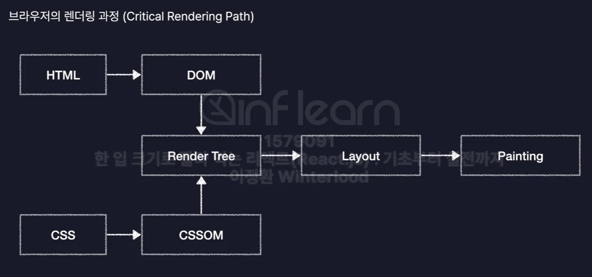
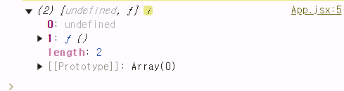
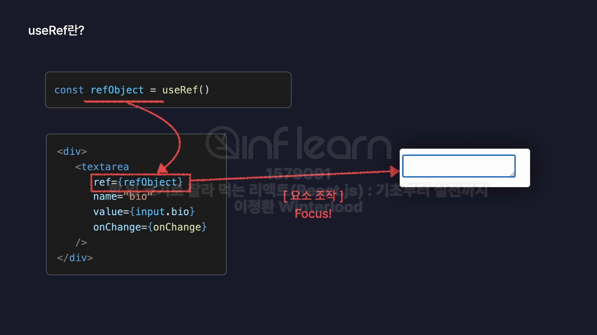
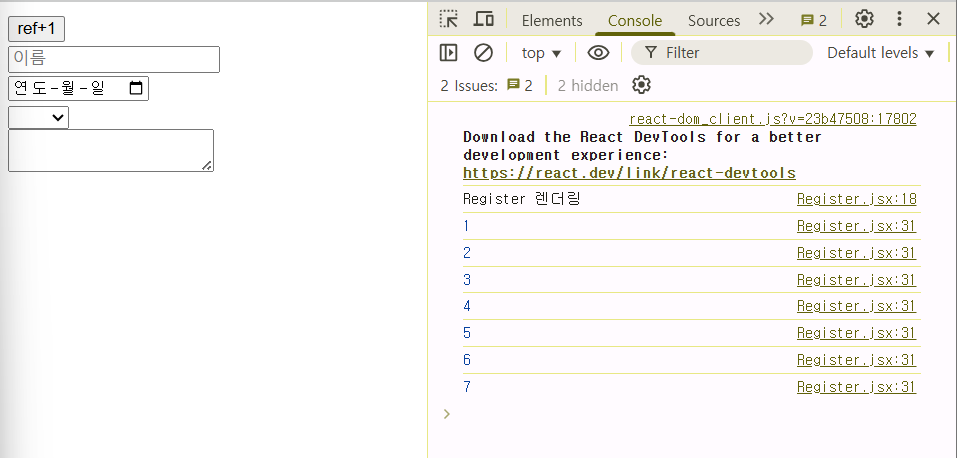
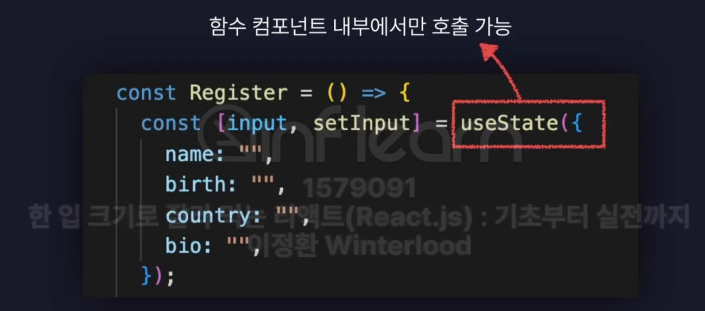

# Node.js & React.js

## Node.js

### 1. Node.js

- 웹 브라우저가 아닌 환경에서도 JS코드를 실행시켜주는JS의 런타임, 즉 실행환경
- JS 터미널을 이용한 Node.js 실행
    - 패키지 생성하기: `npm -init`
    - 파일 실행하기: `node [파일경로/파일명]`
        
        - 패키지 스크립트를 이용해 start: “[파일경로/파일명]”을 설정해두면 터미널에 경로를 명시하지 않아도 됨
        

### 2. Node.js의 모듈 시스템

- 모듈: 각 기능별로 나누어진 JS 파일
    - 쇼핑몰 시스템 → 회원 관리 기능 모듈, 장바구니 기능 모듈, 결제 기능 모듈
    - 만약 장바구니에 기능을 추가하고 싶다면 장바구니 기능 모듈만 열어서 수정하면 됨
- 모듈 시스템
    
    > **CJS (Common JS 모듈 시스템)**
    > 
    > - 모듈이라는 내장 객체에 exports라는 프로퍼티의 값으로 객체를 저장하여 내보낼 수 있음.
    > - CJS에서 다른 모듈에서 내보낸 모듈을 불러오기 위해서는 require 사용
    > 
    > ```jsx
    > //math 모듈
    > function add(a,b){
    >     return a +b;
    > }
    > 
    > function sub(a,b){
    >     return a- b;
    > }
    > 
    > module.exports = {
    >     add,
    >     sub,
    > }
    > ```
    > 
    > ```jsx
    > //math모듈을 불러와서 사용하기 위해서 require 사용
    > const moduleData = require("./math");
    > console.log(moduleData.add(1,2));
    > console.log(moduleData.sub(1,2));
    > 
    > //객체의 구조분해 할당 사용시
    > // const {add, sub} = require("./math");
    > //console.log(add(1,2));
    > //console.log(sub(1,2));
    > ```
    > 
    
    > **ES 모듈 시스템**
    > 
    > 
    > : 사용하기 위해서 package.json 파일에 `"type": "module"` 을 함께 작성해줘야함. ⇒ 앞으로 해당 package는 ES모듈 시스템을 사용하겠다는 뜻
    > 
    > - 객체를 내보낼 때: `export{add,sub};`와 같이 export 키워드 뒤에 객체를 리터럴로 생성해서 그 안에 내보내고 싶은 값들을 담아주거나 `내보낼 함수 앞에 export 키워드 작성`
    > - 객체를 가져올 때: `import {add,sub} from "./math.js";` 와 같이 import 키워드 뒤에 가져올 객체를 작성하고 from “파일.확장자명”으로 불러옴
    > 
    > ```jsx
    > //math 모듈
    > //ES 모듈 시스템: export 키워드 사용
    > //방법 1
    > /*
    > function add(a,b){
    >     return a +b;
    > }
    > 
    > function sub(a,b){
    >     return a- b;
    > }
    > 
    > export{add,sub};
    > */
    > //방법2
    > 
    > export function add(a,b){
    >     return a +b;
    > }
    > 
    > export function sub(a,b){
    >     return a- b;
    > }
    > //default 키워드 사용시 이 math모듈을 대표하는 기본값이 됨
    > export default function multiply(a,b){
    > 	return a*b;
    > }
    > ```
    > 
    > ```jsx
    > import import mul from "./math.js";
    > import {add,sub} from "./math.js";
    > 
    > console.log(add(1,2));
    > console.log(sub(1,2));
    > console.log(mul(1,2));
    > ```
    > 

### 3. Node.js의 라이브러리

> **라이브러리**
> 
> 
> : 프로그램을 개발할 떄 필요한 다양한 기능들을 미리 만들어 모듈화해놓은 것
> 
> - 날짜/ 수학/ 그래픽 라이브러리 등을 설치하여 import로 불러와 사용 가능
> - (https://www.npmjs.com/)에서 Node.js의 모든 라이브러리를 설치할 수 있음
> 
> ```coq
> // 설치 완료시 package.json파일에 다음과 같은 코드가 추가된 것을 확인할 수 있음 
> "dependencies": {
>     "randomcolor": "^0.6.2"
> ```
> 
> ```jsx
> //라이브러리를 불러올 때는 from뒤에 라이브러리의 이름만 명시해주면 됨
> import randomColor from "randomcolor";
> const color = randomColor();
> console.log(color);
> ```
> 
> - 라이브러리가 설치된 뒤  package-lock.json 파일이 삭제되었거나 공유, github 업로드시에는 package.json 파일만 있으면 언제든지 `npm i` 명령어를 통해서 필요한 라이브러리를 다시 설치할 수 있기 때문에 node_modules 폴더는 공유하지 않아도됨

## React.js

### 1. React란?

> **React**
> 
> 
> : Meta(Facebook)이 개발한 오픈소스 JS 라이브러리로, 대규모 웹 서비스의 UI를 더 편하게 개발하기 위해 만든 기술 
> 
> - 넷플릭스, 페이스북, 인스타그램, 노션 등이 React.js를 통해 만들어진 서비스

> **React.js의 기술적인 특징**
> 
> 1. 컴포넌트를 기반으로 UI를 표현함
>     - 컴포넌트: 화면(UI)을 구성하는 요소
>     - header, main, footer처럼 컴포넌트를 JS파일로 모듈화하여 중복 코드를 제어할 수 있게 됨
> 2. 화면 업데이트 구현이 쉬움
>     - 업데이트: 사용자의 행동(클릭, 드래그)에 따라 웹 페이지가 스스로 모습을 바꿔 상호작용하는 것
>     - 선언형 프로그래밍: 과정은 생략하고 목적만 간결히 명시하는 방법
>         - React는 선언형 프로그래밍으로 동작하기 떄문에 업데이트를 위한 복잡한 동작을 직접 정의할 필요 없이 특정 변수의 값을 바꾸는 것만으로도 화면을 업데이트 시킬 수 있음
>         - 각각의 컴포넌트에는 현재의 컴포넌트 상태를 저장하는 state가 존재하는데, 이 state 값에 따라 각각 다른 UI를 화면에 렌더링하도록 설정할 수 있음
>     - 명령형 프로그래밍: 목적을 이루기 위한 모든 일련의 과정을 설명하는 방
>         - JS는 명령형 프로그래밍으로 동작하기 때문에 코드가 비교적 길고 복잡해질 수 있음
> 3. 화면 업데이트가 빠르게 처리됨
>     
>     
>     
>     - 브라우저는 HTML과 CSS로 작성한 웹페이지를 위와 같은 렌더링 과정(Critical Rendering Path)을 거침
>         
>         ① HTML은 DOM(Document Object Model)으로, CSS는 CSSOM(CSS Object Model)로 변환됨
>         
>         ② DOM과 CSSOM을 합쳐서 웹페이지의 설계도 역할을 하는 Render Tree 생성
>         
>         - DOM에는 HTML로 표현한 요소들의 위치나 배치, 모양 등에 관한 정보
>         
>         - CSSOM에는 CSS로 표현한 요소들의 스타일과 관련된 정보
>         
>         - 이 두가지 정보를 합쳐서 만든 Render Tree에는 화면에 나타나야 하는 렌더링되어야하는 요소들의 모든 정보가 다 포함되어 있게 됨
>         
>         ③ Layout: 웹페이지라는 공간 안에 렌더트리에 포함되어이 있는 요소들의 배치를 잡는 작업
>         
>         ④ Painting: 요소를 실제로 화면에 그려내는 과정
>         
>     - 화면의 업데이트는 JS가 DOM을 수정하게 되면 발생하게 됨
>         - Layout과정과 Painting 과정은 상당히 오래 걸리는 작업으로, DOM이 수정되어서 Layout이 다시 진행되는 것을 Reflow라고 하고, Painting 작업이 다시 진행되는 것을 Repaint라고 함
>         - DOM 수정 횟수를 최소화하는 것이 중요 ⇒ React는 Virtual DOM을 이용
>             
>             - 업데이트가 발생하면 실제 DOM을 바로 수정하는 것이 아니라 가상의 DOM을 먼저 수정한 뒤 실제 DOM에 반영 
>             
>             - 가상의 DOM이 일종의 버퍼 역할을 하여 최종적으로 실제 DOM을 한 번 수정하기 때문에 DOM 수정 횟수를 최소화할 수 있게 됨
>             

### 2. React App 생성 및 실행 (with Vite - 프론트엔드 개발툴)

- `npm create vite@latest` 명령어를 이용해 React App 생성
    - public 폴더 → svg나 png, jpg 같은 이미지 파일들을 보관하거나, 폰트와 동영상 같은 정적인 파일을 보관하는 저장소
    - src 폴더 /asset → public 폴더와 동일하게 이미지나 폰트 등의 정적 파일을 보관할 수 있으나 차이가 있음
    - .eslintrc.cjs →개발자들의 코드 스타일을 통일하는데 도움을 주는 도구
    - index.html → 리액트 앱의 기본 틀 역할을 하는 HTML 코드가 담긴 파일
- `npm run dev` 명령어를 이용해 React App 가동

## 🐾 React 입문

### 1. React 컴포넌트

> **React 컴포넌트 생성**
> 
> - 컴포넌트는 HTML 태그들을 반환하는 함수로, 컴포넌트는 보통 함수의 이름을 따서 부름
> - 컴포넌트를 생성하는 함수의 **이름은 반드시 첫글자가 대문자**가 되어야 React에서 컴포넌트로 인정해줌
> - 함수 선언식, 화살표 함수, 클래스를 이용하여 컴포넌트를 만들 수 있음
> 
> ```jsx
> //App.jsx 파일
> import './App.css'
> 
> function App() {
>   return (
>     <>
>      <h1>안녕 리액트!</h1>
>     </>
>   )
> }
> 
> export default App
> 
> ```
> 
> ```jsx
> import { StrictMode } from 'react'
> import { createRoot } from 'react-dom/client'
> import './index.css'
> import App from './App.jsx'
> 
> createRoot(document.getElementById('root')).render(
>   <App />
> )
> 
> ```
> 

> **컴포넌트 렌더링**
> 
> - 생성한 컴포넌트를 React앱의 화면에 표시(렌더링)하기 위해서는 App컴포넌트 → return문 안 → < [컴포넌트명] />를 작성해주어야 함
> 
> ```jsx
> import './App.css'
> 
> function Header(){  //자식 컴포넌트
>   return(
>     <header>
>       <h1>header</h1>
>     </header>
>   )
> }
> 
>   function App() { //부모 컴포넌트 
> 
>   return (
>     <>
>     <Header />
>      <h1>안녕 리액트!</h1>
>     </>
>   )
> }
> 
> export default App
> 
> ```
> 
> - Header 컴포넌트 ⇒ 자식 컴포넌트
> - App 컴포넌트 ⇒ 부모 컴포넌트 ⇒ root 컴포넌트
> - 모든 리액트 컴포넌트들은 App 컴포넌트를 최상위의 부모 컴포넌트로 가짐

> **컴포넌트 모듈화**
> 
> - 모듈화를 위해 컴포넌트 별로 각각 파일을 나눠서 작성
> 
> ```jsx
> //Header.jsx 파일 생성 후 export 해주어야 함
> 
> function Header(){  //자식 컴포넌트
>     return(
>       <header>
>         <h1>header</h1>
>       </header>
>     )
>   }
> 
>   export default Header;
> ```
> 
> - 생성된 모듈은 항상 export로 내보내기 + App.jsx 파일에서 import 불러오기 해줘야
> 
> ```jsx
> //생성한 Header.jsx를 import 해주어야 함
> 
> import './App.css'
> import Header from "./components/Header.jsx"
>   function App() { //부모 컴포넌트 
> 
>   return (
>     <>
>     <Header />
>      <h1>안녕 리액트!</h1>
>     </>
>   )
> }
> 
> export default App
> 
> ```
> 

### 2. JSX로 UI 표현하기

> **JSX(JavaScript Extensions)**
> 
> 
> : React 컴포넌트가 화면에 나타나는 UI 요소들을 표현할 수 있도록 도와주는 확장된 JS 문법
> 

> **JSX 주의 사항**
> 
> 1. **중괄호 내부**에는 자바스크립트 표현식만 넣을 수 있다.
>     - 단일값에 대한 결과를 나타낼 수 있는 삼항연산자는 사용 가능
>     - 중괄호 안에 if, for 등은 사용할 수 없음
> 2. 숫자, 문자열, 배열 값만 렌더링된다.
>     - boolean, null, undefined는 렌더링할 수 없음.
>     - 객체의 경우, 객체 자체는 렌더링할 수 없지만 객체의 요소에 접근하는 점표기법으로는 가능
> 3. 모든 태그는 닫혀있어야 한다. <> </>
> 4. 최상위 태그는 반드시 하나이어야 한다. <main></main>
> 
> ```jsx
> const Main = ()=>{
>     const number =10;
>     const obj = {a:1};
>   
>     return(
>         <main> 
>             <h1>main</h1>
>             <h2>{number%2===0?"짝수":"홀수"}</h2>
>             {obj.a} 
>         </main>
>     );
> };
> 
> export default Main;
> ```
> 
- ex: JSX 문법을 이용하여 Main 컴포넌트 안에 조건에 따라 각각 다른 UI를 렌더링하도록 만들어 보아라
    
    ```css
    /* Main.css */
    
    .logout{
        background-color: yellow;
        border: 5px solid green;
        margin:50px;
        width:80px;
    }
    ```
    
    ```jsx
    // Main.jsx
    import "./Main.css";
    
    const Main = ()=>{
        const user = {
            name: "안유경",
            isLogin: true,
        }
        if(user.isLogin){
            return <div className="logout"> 로그아웃</div>
        }
        else{
            return <div>로그인</div>
        }
        // return(
        //     <>
        //     {user.isLogin?(<div>로그아웃</div>):(<div>로그인</div>)}
        //     </>
        // );
    };
    
    export default Main;
    ```
    
    - JSX는 JS와 HTML을 함께 쓰고 있기 때문에 JS의 예약어인 class = “logout”를 쓸 수 없어 className = “logout”를 사용해야함
    - Main.css에서는 className이 logout으로 끝나는 클래스에 대해서 코드 내용을 적용하는 CSS가 작성되어 있음

### 3. Props로 데이터 전달하기

- React에서는 부모 컴퍼넌트가 자식 컴퍼넌트에게 마치 함수의 인수를 전달하듯이 원하는 값 (props)을 전달해주는 것이 가능
- props를 이용하면 컴퍼넌트를 마치 함수 호출하듯이 전달하는 값에 따라 각각 다른 UI를 렌더링할 수 있도록 만들 수 있음

> **props의 기본값 설정**
> 
> - props를 구조분해할당 문법으로 받아오도록 변경한 후, 구조분해할당 문법에서 기본값 문법으로 props의 기본값을 설정하면 됨
>     
>     ```jsx
>     const Button = ({text, color="black"})=>{
>         return <button style={{color:color}}>{text}-{color}</button>;
>     };
>     
>     export default Button;
>     ```
>     
> - 만약 props로 전달해야 하는 값이 많다면 따로 객체를 선언한뒤 스프레드 연산자를 이용해서 전달하는 것이 효율적
>     
>     ```jsx
>     import './App.css'
>     import Header from "./components/Header.jsx"
>     import Main from "./components/Main.jsx"
>     import Footer from "./components/Footer.jsx"
>     import Button from "./components/Button.jsx"
>     
>       function App() { //부모 컴포넌트 
>       const buttonProps = {
>         text:"메일",
>         color:"red",
>         a:1,
>         b:2,
>         c:3,
>       }
>     
>       return (
>         <>
>         <Header />
>         <Main />
>         <Button {...buttonProps}/>
>         <Button text={"카페"}/>
>         <Button text={"블로그"}>
>           <div>자식 요소</div>  
>         </Button>
>         <Footer />
>     
>         </>
>       )
>     }
>     
>     export default App
>     
>     ```
>     
> - \<Button> 태그의 자식요소가 된 \<div>태그는 자동적으로 Button 컴포넌트에게 children이라는 이름의 props로 전달됨
>     
>     ```jsx
>     import './App.css'
>     import Header from "./components/Header.jsx"
>     import Main from "./components/Main.jsx"
>     import Footer from "./components/Footer.jsx"
>     import Button from "./components/Button.jsx"
>     
>       function App() { //부모 컴포넌트 
>       const buttonProps = {
>         text:"메일",
>         color:"red",
>         a:1,
>         b:2,
>         c:3,
>       }
>     
>       return (
>         <>
>         <Header />
>         <Main />
>         <Button {...buttonProps}/>
>         <Button text={"카페"}/>
>         <Button text={"블로그"}>
>           <div>자식 요소</div>  
>         </Button>
>         <Footer />
>         </>
>       )
>     }
>     
>     export default App
>     
>     ```
>     
>     ```jsx
>     //Button.jsx
>     
>     const Button = ({children, text, color="black"})=>{
>         return (
>         <button style={{color:color}}>
>             {text}-{color}
>             {children}
>         </button>
>         )
>     };
>     
>     export default Button;
>     ```
>     

### 4. 이벤트 핸들링

> **이벤트**
> 
> 
> : 웹 내부에서 발생하는 사용자의 행동 (버튼클릭, 메세지 입력, 스크롤 등)
> 
> **이벤트 핸들링**
> 
> : 이벤트가 발생했을 때 그것을 처리하는 것 (버튼 클릭식 경고창 노출)
> 
> **버튼의 이벤트 핸들링**
> 
> - **`onClick = {}`**
>     - **버튼이 클릭되면** 중괄호{ }안에 들어가는 내용을 실행
>     - 아래 코드의 경우 버튼이 클릭되면 중괄호 안의 화살표 함수가 실행됨
>         
>         ```jsx
>         const Button = ({children, text, color="black"})=>{
>             return (
>             <button onClick={()=>{console.log(text);}}  style={{color:color}}>
>                 {text}-{color.toUpperCase()}
>                 {children}
>             </button>
>             )
>         };
>         
>         Button.defaultProps = {
>             color:"black",
>         };
>         
>         export default Button;
>         ```
>         
> - **`onMouseEnter= {}`**
>     - **버튼 위에 마우스를 가져다대면** 중괄호{ }안에 들어가는 내용을 실행
>         
>         ```jsx
>         const Button = ({children, text, color="black"})=>{
>             return (
>             <button onMouseEnter={()=>{console.log(text+"를 선택?");}}  style={{color:color}}>
>                 {text}-{color.toUpperCase()}
>                 {children}
>             </button>
>             )
>         };
>         
>         Button.defaultProps = {
>             color:"black",
>         };
>         
>         export default Button;
>         ```
>         
> 
> **SyntheticBaseEvent (합성 이벤트)**
> 
> : 모든 웹 브라우저의 이벤트 객체를 하나의 포맷으로 통일한 형태
> 
> - Cross Browsing Issue: 브라우저 별 스펙이 달라 발생하는 문제
> - 합성 이벤트는 이러한 cross browsing issue를 해결하기 위해 여러 브라우저들의 규격을 참고해서 하나의 통일된 규격으로 이벤트 객체를 포맷팅한 것
> - onClick, onMouseEvent와 같은 이벤트에서 매개변수로 넘겨지는 것을 SyntheticEvent라고 함
> 
> ```jsx
> const Button = ({children, text, color="black"})=>{
> 	    
> 	    const onClickButton = (**e**)=>{ 
>         console.log(**e**); 
>         console.log(text);
>     };
>     return (
>     <button 
>     //onMouseEnter={()=>{console.log(text+"를 선택");}} 
>     onClick ={onClickButton} style={{color:color}}>
>         {text}-{color.toUpperCase()}
>         {children}
>     </button>
>     )
> };
> 
> Button.defaultProps = {
>     color:"black",
> };
> 
> export default Button;
> ```
>
### 5. State - 상태 관리하기

> **State**
> 
> 
> : 현재 가지고 있는 형태나 모양을 정의하는 값이면서 변화할 수 있는 동적인 값.
> 
> - React의 컴포넌트들은 자신의 현재 상태를 보관하는 state 변수를 가질 수 있음
> - state 값에 따라 각각 다른 UI를 화면에 렌더링할 수 있음
> - 가변적으로 값을 변경시키고 싶다면 let을 이용한 JS 변수를 선언하는것이 아니라 state와 관련된 내장함수를 사용해야
> 
> **함수 컴포넌트에서 state를 생성**
> 
> - React에서 제공하는 useState 내장 함수를 사용해야함
> 
> ```jsx
> import './App.css'
> import {useState} from "react"; //state 생성을 위한 import문
> 
>   function App() { 
>     const [state, setState] = useState("초기값"); //구조 분해 할당으로, **state에는 useState를 통해 생성한 state 값**이, **setState에는 useState의 값을 변화하는 함수**가 저장됨. 
>     console.log(state);
>     
>   return (
>     <>
>     </>
>   );
> }
> 
> export default App;
> 
> ```
> 
> 
> 
> - **useState()의 함수는 다음과 같은 2개의 요소를 담은 배열을 반환: {”초기값”, f}**
>     - 1번째 요소: 생성된 state의 현재 값
>     - 2번째 요소: state의 값을 변화시키는 상태 변화 함
> 
> **state 렌더링: return문 안에 `{state 변수명}` 작성** 
> 
> - 최초로 렌더링 될 때는 state 값=0 전달되어 렌더링
> - 버튼을 클릭하면 state 값이 변경되도록 리렌더링
> - ex: light state 값에 따라 ON/OFF 표시하도록 렌더링하라.
> 
> ```jsx
> import './App.css'
> import {useState} from "react"; //state 생성을 위한 import문
> 
>   function App() { 
>     const [count, setCount] = useState(0); 
>     const [light, setLight] = useState("OFF");
>     
>   return (
>     <>
>     <div>
>       <h1>Light State</h1>
>       <h2>{light}</h2>
>       <button onClick={()=>{
>         // if(light==="OFF")
>         //   setLight("ON");
>         // else setLight("OFF");
>         setLight(light==="ON"? "OFF":"ON")
>       }}>
>         {light==="ON"?"끄기":"켜기"}
>         </button>
>     </div>
>     <div>
>       <h1>{count}</h1> 
>       <button onClick={()=>{
>         setCount(count+1);
>       }}>
>       +
>       </button>
>     </div>
>     
>     </>
>   );
> }
> 
> export default App;
> ```
> 

### 6. State와 Props

- React 컴포넌트의 리렌더링이 발생하는 3가지 경우
    - 자신이 관리하는 state 값이 변경될 때
    - 제공받는 props의 값이 변경될 때
    - 부모 컴포넌트가 리렌더링되면서 자식 컴포넌트까지 함게 리렌더링 될 때
- state를 props로 전달할 때 발생할 수 있는 리렌더링 문제를 해결하기 위해 관련 없는 컴포넌트는 분리하여 불필요한 리렌더링을 제거하는 것이 좋음
    
    ```jsx
    import './App.css'
    import {useState} from "react"; 
    
    const Bulb = ({light})=>{
    	console.log(light);
      return(
        <div>
    	    {light==="ON"?<h1 style={{backgroundColor:"orange"}}>ON</h1>:<h1 style={{backgroundColor:"gray"}}>OFF</h1>}
        </div>
        );
      };
    
    function App() {   
    	const [count, setCount] = useState(0);    
    	const [light, setLight] = useState("OFF");
      return (
        <>
        <Bulb light={light} />  
        <div>
            <button onClick={()=>{
            setLight(light==="ON"? "OFF":"ON")
          }}>
            {light==="ON"?"끄기":"켜기"}
            </button>
          </div> 
          <div>
          <h1>{count}</h1> 
          <button onClick={()=>{
            setCount(count+1);
          }}>
          +
          </button>
        </div>
        </>
      );
    }
    
    export default App;
    
    ```
    
    - 아래 코드는 위의 코드에서 리렌더링 문제가 발생하는 것을 해결하기 위해서 Bulb.jsx와 Counter.jsx로 컴포넌트를 분리하여 App 컴포넌트에서 호출하도록 수정한 결과.

```jsx
import {useState} from "import {useState} from "react";
const Bulb = ()=>{
    const [light, setLight] = useState("OFF");

    return(
      <div>
        {light==="ON"?<h1 style={{backgroundColor:"orange"}}>ON</h1>:<h1 style={{backgroundColor:"gray"}}>OFF</h1>}
        <button onClick={()=>{
        // if(light==="OFF")
        //   setLight("ON");
        // else setLight("OFF");
        setLight(light==="ON"? "OFF":"ON")
      }}>
        {light==="ON"?"끄기":"켜기"}
        </button>
      </div>
    );
  };

  export default Bulb;
```

```jsx
import {useState} from "react";

const Counter = ()=>{
    const [count, setCount] = useState(0); 
    return(
      <div>
      <h1>{count}</h1> 
      <button onClick={()=>{
        setCount(count+1);
      }}>
      +
      </button>
    </div>
    );
  };

  export default Counter;
```

```jsx
import './App.css'
import {useState} from "react"; //state 생성을 위한 import문
import Bulb from './components/Bulb';
import Counter from './components/Counter';
  function App() {     
  return (
    <>
    <Bulb />   
    <Counter/> 
    </>
  );
}

export default App;

```

### 7. State로 사용자 입력 관리

- ex: 간단한 회원가입 폼을 렌더링하는 컴퍼넌트
    
    ```jsx
    //간단한 회원가입 폼
    //1. 이름
    //2 생년월일
    //3. 국적
    //4. 자기소개
    
    import {useState} from "react";
    
    const Register=()=>{
        const [name, setName]=useState("이름");
        const [birth,setBirth]=useState("");
        const [country, setCountry]=useState("");
        const [bio, setBio]=useState("");
        
        const onChangeName=(e)=>{
            setName(e.target.value);
        };
        const onChangeBirth=(e)=>{
            setBirth(e.target.value); //e.target의 value 프로퍼티에 접근하면 사용자가 input칸에 입력한 value에 접근할 수 있음
        };
        const onChangeCountry=(e)=>{
            setCountry(e.target.value); 
        };
        const onChangeBio=(e)=>{
            setBio(e.target.value);
        };
    
        return(
            <div>
                <div>
                    <input
                    value={name} 
                    onChange={onChangeName} 
                    placeholder = "이름"/>
                </div>
                <div>
                    <input 
                    type="date" 
                    value={birth}
                    onChange={onChangeBirth}/> 
                </div>
                <div>
                    <select value={country} onChange={onChangeCountry}>
                        <option value=""></option>
                        <option value="kr">한국</option>
                        <option value="us">미국</option>
                        <option value="uk">영국</option>
                    </select>
                </div>
                <div>
                    <textarea value={bio} onChange={onChangeBio}></textarea>
                    {bio}
                </div>
            </div>
        );
    };
    
    export default Register;
    ```
    
    - `<input> <input/>`: 정보를 입력할 수 있는 칸
        - `onChange={}`: input칸의 변경이 발생했을
        - `placeholder={}`: 입력 전 input칸에 글씨를 띄울 수 있음
    - `<select> <select/>`: select box를 이용해 주어진 option 중 하나를 선택
        - `<option> <option/>`: select box의 option
            - `value={}`: option의 value를 지정해 주로 select box에는 자세히, value로 간단한 값을 넘겨주는 식으로 사용
    - 중복 코드 최소화
    
    ```jsx
    //간단한 회원가입 폼
    //1. 이름
    //2 생년월일
    //3. 국적
    //4. 자기소개
    
    import {useState} from "react";
    
    const Register=()=>{
        
        const [input, setInput]=useState({
            name: "",
            birth: "",
            country: "",
            bio:""
        });
    
        const onChange=(e)=>{
            setInput({
            ...input,
            [e.target.name]:e.target.value,
            });
        };
    
        return(
            <div>
                <div>
                    <input
                    name="name"
                    value={input.name} 
                    onChange={onChange} 
                    placeholder = "이름"/>
                </div>
                <div>
                    <input 
                    name="birth"
                    type="date" 
                    value={input.birth}
                    onChange={onChange}/> 
                </div>
                <div>
                    <select name="country" value={input.country} onChange={onChange}>
                        <option value=""></option>
                        <option value="kr">한국</option>
                        <option value="us">미국</option>
                        <option value="uk">영국</option>
                    </select>
                </div>
                <div>
                    <textarea name="bio" value={input.bio} onChange={onChange}></textarea>
                </div>
            </div>
        );
    };
    
    export default Register;
    ```

### 8. useRef

> **UseRef**
> 
> 
> : 새로운 Reference 객체를 생성하는 기능
> 
> - `const refObject = useRef()`
> - useRef는 컴포넌트 내부의 변수로 활용 가능하다는 점에서 useState와 비슷해보이지만 useState와는 달리 어떤 경우에도 리렌더링을 유발하지 않음
> - 컴포넌트가 렌더링하는 특정 DOM 요소에 접근, 조작이 가능
>     
>     
>     
> 
> - 최초로 refObj가 렌더링 될 때 Register 렌더링이 출력되고, 그 이후로는 리렌더링 없이 이벤트 핸들러 실행이 되고 있음
>     
>     ```
>      import {useRef} from "react";
>     	
>      const refObj = useRef(0);
>         console.log("Register 렌더링");
>         
>         ...
>         
>         return(
>             <div>
>             <button onClick={()=>{
>                 refObj.current+=1;
>                 console.log(refObj.current);
>             }}>ref+1</button>
>             
>             ...
>     ```
>     
>     
>     
> 
> - 컴퍼넌트 내부에서 리렌더링을 유발시키지 않는 변수를 만들어야할 때 왜 굳이 JS 변수가 아닌 useRef를 써야하는 걸까?
>     - input 값의 변경이 일어나면 onChange 이벤트 핸들러가 실행되면서 state의 값을 변경하게 되기 때문에 Register 컴퍼넌트가 리렌더링 됨 → Register안에 있는 `let count = 0;`가 다시 호출되기 때문에 수정할 때마다 수정 횟수가 업데이트 되지 못하고 계속 0으로 초기화되기 때문에 1을 여러 번 출력하게 되는 것임
- 레퍼런스 객체 활용
    
    EX1) 작성한 4개의 폼의 변경이 얼만큼 이루어졌는지 수정 횟수를 카운트하는 레퍼런스 객체
    
    ```jsx
     //
     const countRef = useRef(0);
    
        const onChange=(e)=>{
            countRef.current+=1;
            console.log(countRef.current);
            setInput({
            ...input,
            [e.target.name]:e.target.value,
            });
        };
    ```
    
    EX2) 레지스터 컴퍼넌트가 렌더링하고 있는 DOM 요소들을 조작하는 기능 (작성한 회원가입 폼을 제출하기 위해 ‘name’ 칸의 작성이 완료되었는지 확인해야함. 그렇지 않다면 레퍼런스 객체의 focus함수를 이용해 DOM에 포커스를 주어야함)
    
    - 포커스: 특정 객체를 선택된 상태로 만드는 것
    
    ```jsx
    //간단한 회원가입 폼
    //1. 이름
    //2 생년월일
    //3. 국적
    //4. 자기소개
    
    import {useState, useRef} from "react";
    
    const Register=()=>{
        const [input, setInput] = useState({
            name: "",
            birth: "",
            country: "",
            bio:""
        });
    
        const countRef = useRef(0);
        const inputRef = useRef();
    
        const onChange=(e)=>{
            countRef.current+=1;
            console.log(countRef.current);
            setInput({
            ...input,
            [e.target.name]:e.target.value,
            });
        };
        
        const onSubmit=()=>{    //사용자가 4개의 폼에 입력을 모두 완료했는지를 확인해야함
            if(input.name===""){    //만약 input state의 name값이 빈 문자열이라면 이름을 입력하도록 focus를 줄 수 있음
                //이름을 입력하는 DOM 요소에 포커스
                inputRef.current.focus();
            }
        };
    
        return(
            <div>
                <div>
                    <input
                    ref={inputRef}  //input 태그가 렌더링하는 DOM요소가 inputRef라는 레퍼런스 객체에 저장됨
                    name="name"
                    value={input.name} 
                    onChange={onChange} 
                    placeholder = "이름"/>
                </div>
                <div>
                    <input 
                    name="birth"
                    type="date" 
                    value={input.birth}
                    onChange={onChange}/> 
                </div>
                <div>
                    <select name="country" value={input.country} onChange={onChange}>
                        <option value=""></option>
                        <option value="kr">한국</option>
                        <option value="us">미국</option>
                        <option value="uk">영국</option>
                    </select>
                </div>
                <div>
                    <textarea name="bio" value={input.bio} onChange={onChange}></textarea>
                </div>
                <button onClick={onSubmit} >제출</button>
            </div>
        );
    };
    
    export default Register;
    ```
    

### 9. React Hooks

> **React Hooks**
> 
> 
> : 클래스 컴포넌트의 기능을 함수 컴포넌트에서도 이용할 수 있도록 도와주는 메서드 
> 
> - 2017년 이전의 React → **클래스** 컴포넌트(State, Ref 등의 모든 기능 이용 가능) + **함수** 컴포넌트(UI렌더링만 가능)
> - 이후 React Hooks이 개발되면서 **함수** 컴포넌트에서도 class 컴포넌트의 기능을 이용할 수 있게 됨(useState, useRef, useEffect, useReducer )
> - React Hooks 앞에는 use라는 접두사가 붙음: 나만의 Custom hook을 만들어 쓸 수 있음
> - **함수** 컴포넌트 내부에서만 호출될 수 있고, 조건문이나 반복문에서는 호출 불가
>     
>     
>     
> 
> ```jsx
> // //3가지 Hook과 관련된 팁
> // 1. 함수 컴포넌트 또는 custom hook 내부에서만 호출이 가능
> // 2. 조건부로 호출할 수 없음
> // 3. 나만의 훅(custom hook)을 직접 만들 수 있음 
> //3-1. custom hook은 보통 별도의 폴더에 따로 보관
> 
> import useInput from "./../hooks/useInput";
> 
> const HookExam = ()=>{
>     const [input, onChange] = useInput();
>     return(
>     <div>
>         <input value ={input} onChange={onChange}/>
>     </div>);
> };
> 
> export default HookExam;
> 
> ```
> 
> ```jsx
> // useInput.jsx
> 
> import {useState} from "react";
> 
> function useInput(){
>     const [input, setInput] = useState("");
>     const onChange=(e)=>{
>         setInput(e.target.value);
>     };
>     return [input, onChange];
> }
> 
> 	export default useInput;
> 	// named export를 사용했기 때문에 App.jsx에서 import 할 때 {useImput}가 아닌 useput을 써줘야 오류가 나지 않는다
> ```
>
# 라이프 사이클
### 1. 라이프 사이클

> **React의 life cycle (생애 주기)**
> 
> 
> : **Mount → Update → unMount**
> 
> 1. Mount (탄생)
>     - 컴포넌트가 탄생하는 순간
>     - 화면에 처음 렌더링 되는 순간
> 2. Update (변화)
>     - 컴포넌트가 리렌더링 되는 순간
> 3. unMount (죽음)
>     - 컴포넌트가 화면에서 사라지는 순간
>     - 렌더링에서 제외되는 순간
>     
> 
> **Life cycle 제어**
> 
> : React 컴포넌트의 라이프 사이클의 단계별로 컴포넌트들이 각각 원하는 타이밍에 어떠한 작업을 수행하도록 하는 것 
> 
> - 컴포넌트가 Mount되었을 때 백엔드 서버에 네트워크 요청을 보내서 데이터를 불러오는 기능을 만들 수 있음
> - 컴포넌트가 Update되었을 때 변경된 값이 현재 무엇인지 콘솔에 출력하도록하는 기능을 만들 수 있음
> - 컴포넌트가 unMount되었을 때 컴포넌트가 사용하던 여러 유형의 메모리를 정리하는 기능을 만들 수 있음
> - UseEffect 훅을 이용하면 손쉽게 구현할 수 있음

> **useEffect**
> 
> - 첫번째 인수로 **콜백함수**를, 두번째 인수로 배열 **deps(dependency array, 의존성 배열)**을 받아옴
> - deps 배열에 들어가 있는 값이 변경되면 side effect로서 콜백 함수를 실행
> 
> ```jsx
> import './App.css'
> import Viewer from './components/Viewer'
> import Controller from './components/Controller'
> import { useState, useEffect } from "react";
> 
> function App() {
>   const [count, setCount] = useState(0);
>   const [input, setInput] = useState("");
> 
>   //useEffect
>   //첫번째 인수로 콜백함수를, 두번째 인수로 배열을 받아옴 
>   //두번째 인수로 전달한 배열에 들어가 있는 값이 변경되면 sideEffect로서 첫번째 인수로 전달한 콜백 함수를 실행
>   useEffect(() => {
>     console.log(`count: ${count} / input: ${input}`);
>   }, [count, input]);
>   //count나 input의 값이 바뀌면 콜백함수를 통해 count의 값이 콘솔창에 출력됨
>   
>   //Controller 컴포넌트의 button을 누르면 값을 더하고 빼는 이벤트 핸들러
>   const onClickButton = (value) => {
>     setCount(count + value);
> 	//이 라인에 console.log(count);을 넣어도 setCount가 비동기로 동작하기 때문에 현재 변경된 count값을 바로 반영하지 못함. 따라서 변경된 state 값에 따른 side effect에 해당하는 부가적인 작업을 하려면 useEffect를 사용해야 함.
>   };
> 
>   return (
>     <div className="App">
>       <h1>Simple Counter</h1>
>       <section>
>         <input 
>         value={input}
>         onChange={(e)=>{
>           setInput(e.target.value)
>         }}></input>
>       </section>
>       <section >
>         <Viewer count={count} />
>       </section>
>       <section>
>         <Controller onClickButton={onClickButton} />
>       </section>
> 
>     </div>
>   )
> }
> 
> export default App
> 
> ```
> 
> **useEffect로 라이프 사이클 제어하기**
> 
> ```jsx
> //Even.jsx
> 
> import {useEffect} from 'react';
> 
> const Even=()=>{
>     useEffect(()=>{
>         //클린업, 정리 함수
>         return ()=>{
>             console.log("unmount");
>         };
>     },[]);
> 
>     return <div>짝수입니다.</div>
> };
> 
> export default Even;
> ```
> 
> ```jsx
> //App.jsx
> 
> import './App.css'
> import Viewer from './components/Viewer'
> import Controller from './components/Controller'
> import Even from './components/Even'
> import { useState, useEffect, useRef } from "react";
> 
> function App() {
>   const [count, setCount] = useState(0);
>   const [input, setInput] = useState("");
> 
>   const isMount = useRef(false);
> 
>   **//1. 마운트: 탄생
>   useEffect(()=>{console.log("mount")},[]);
> 
>   //2. 업데이트: 변화, 리렌더링
>   //deps를 생략
>   //useRef를 이용해서 컴포넌트가 최초로 마운트될 때는 update되지 않도록 하고, 다시 리렌더링이 될때 아래 코드를 실행하도록 설정.
>   useEffect(()=>{
>     if(!isMount.current){
>       isMount.current=true;
>       return;
>     }
>     console.log("update")});
> 
>   //3. 언마운트: 죽음
>   //화면에 나타났다가 사라졌다가 하는 컴포넌트가 필요함 -> Even 컴포넌트**
>   
>   //Controller 컴포넌트의 button을 누르면 값을 더하고 빼는 이벤트 핸들러
>   const onClickButton = (value) => {
>     setCount(count + value);
>   };
> 
>   return (
>     <div className="App">
>       <h1>Simple Counter</h1>
>       <section>
>         <input 
>         value={input}
>         onChange={(e)=>{
>           setInput(e.target.value)
>         }}></input>
>       </section>
>       <section >
>         <Viewer count={count} />
>         **{count % 2 === 0 ? <Even/>:null}**
>       </section>
>       <section>
>         <Controller onClickButton={onClickButton} />
>       </section>
> 
>     </div>
>   )
> }
> 
> export default App
> 
> ```
>
